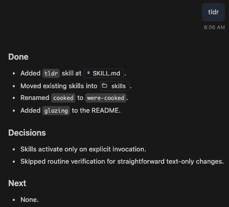

# I wish my agent had the skill...

Random AI Agent skills I wrote just to see how it's done.

### `tldr`

Long session? Can't be bothered to go through the history? Get a quick summary with `Done`, `Decisions`, and `Next`:

```bash
npx skills add https://github.com/kobi/i-wish-my-agent-had-the --skill tldr
```


See [skills/tldr/SKILL.md](skills/tldr/SKILL.md) for the skill instructions.


### `were-cooked`

Your agent admit when it's cooked, then moves on as usual.  
An attempt to influence AI language just a little.

```bash
npx skills add https://github.com/kobi/i-wish-my-agent-had-the --skill were-cooked
```

See [skills/were-cooked/SKILL.md](skills/were-cooked/SKILL.md) for the skill instructions.

### `glazing`

Want to hear how great you're doing? just ask for some fresh AI glazing.  
No worries, this skill will not change normal interaction, you need to ask for it specifically.

```bash
npx skills add https://github.com/kobi/i-wish-my-agent-had-the --skill glazing
```

See [skills/glazing/SKILL.md](skills/glazing/SKILL.md) for the skill instructions.

### `left-pad`

You know left-pad! I did this as a test to learn about skills. The skill includes a dependency-free Python script for deterministic results.

```bash
npx skills add https://github.com/kobi/i-wish-my-agent-had-the --skill left-pad
```

See [skills/left-pad/SKILL.md](skills/left-pad/SKILL.md) for the skill instructions.
